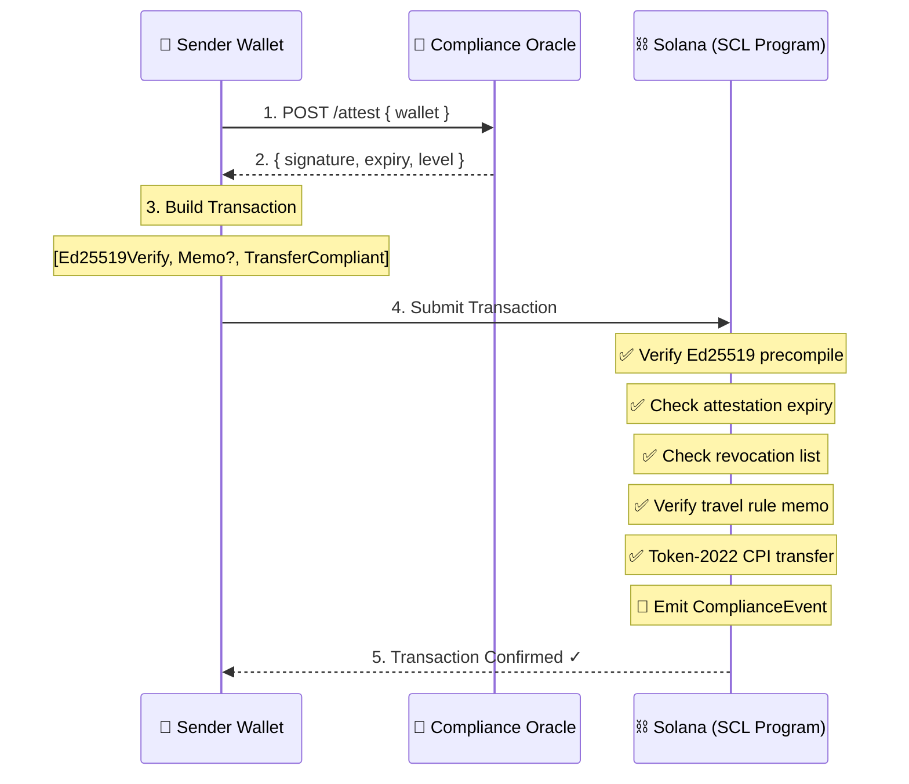
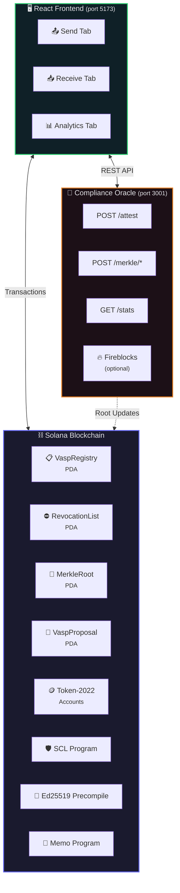
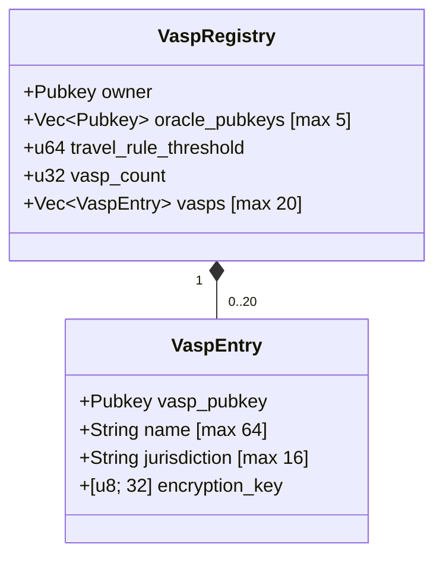
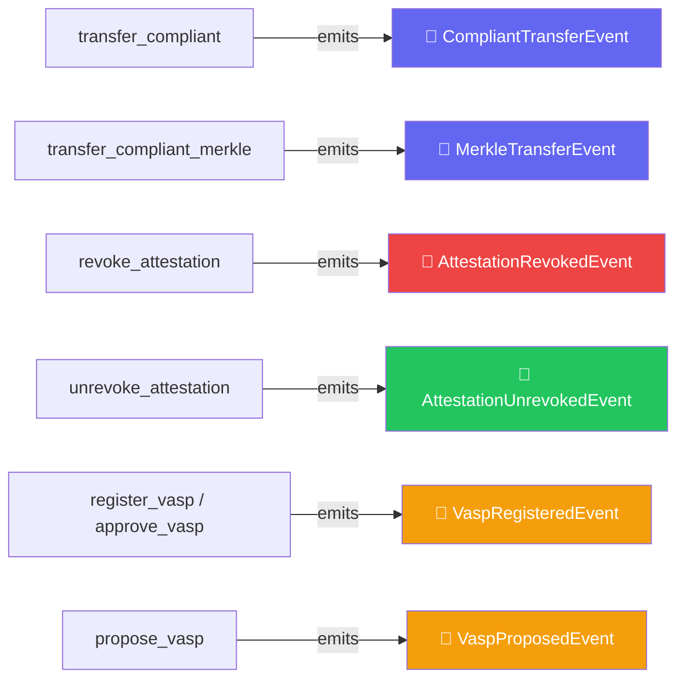
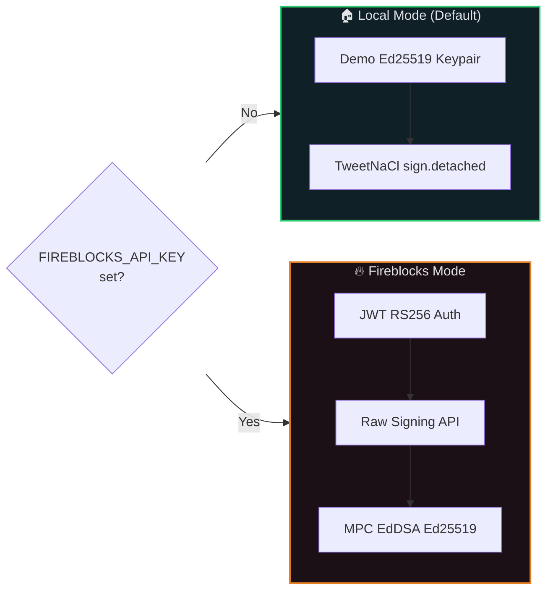
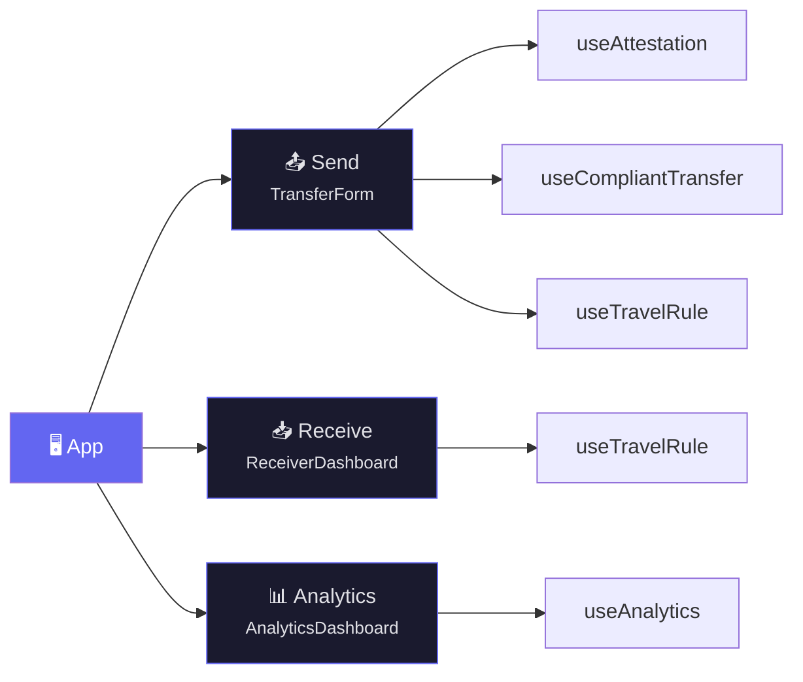
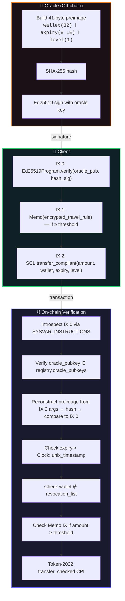

<div align="center">

# 🛡️ SCL — Solana Compliance Layer

### Regulatory Compliance Middleware for Solana Token Transfers

[](https://solana.com)
[](https://anchor-lang.com)
[](https://react.dev)
[](https://typescriptlang.org)
[](https://rust-lang.org)
[](https://nodejs.org)

<br />

[](LICENSE)
[]()
[]()
[]()
[]()
[]()

<br />

**SCL enforces KYC/AML compliance, Travel Rule data exchange, and VASP registry management at the protocol level for Token-2022 transfers on Solana.**

[Getting Started](#-getting-started) · [Architecture](#-architecture) · [Documentation](#-on-chain-program) · [Testing](#-testing) · [API Reference](#-api-endpoints)

</div>

---

## 📖 Table of Contents

<details>
<summary>Click to expand</summary>

- [Overview](#-overview)
- [Architecture](#-architecture)
- [Features](#-features)
- [Project Structure](#-project-structure)
- [On-Chain Program](#-on-chain-program)
  - [Account Schemas](#-account-schemas)
  - [Instructions](#-instructions)
  - [Events](#-events)
  - [Error Codes](#-error-codes)
- [Compliance Oracle](#-compliance-oracle)
  - [API Endpoints](#-api-endpoints)
  - [Signing Modes](#-signing-modes)
  - [Merkle Tree Service](#-merkle-tree-service)
- [Frontend Application](#-frontend-application)
- [Cryptographic Design](#-cryptographic-design)
- [Getting Started](#-getting-started)
- [Configuration](#-configuration)
- [Testing](#-testing)
- [Security](#-security-considerations)

</details>

---

## 🌐 Overview

Financial institutions operating on Solana (**VASPs** — Virtual Asset Service Providers) face regulatory requirements including:

> 🔐 **KYC/AML verification** — ensuring wallet holders are identity-verified before transfers
>
> 📋 **Travel Rule compliance** (FATF Recommendation 16) — exchanging originator/beneficiary data for transfers above a jurisdiction-defined threshold
>
> 🏛️ **VASP registration** — maintaining an on-chain registry of compliant institutions
>
> ⛔ **Attestation revocation** — ability to revoke a wallet's compliance status in real time

SCL enforces all of these **at the protocol level**. A transfer cannot succeed unless the sender holds a valid, non-revoked compliance attestation signed by a trusted oracle, and Travel Rule data is attached when required.

### How It Works



---

## 🏗 Architecture

SCL is a **monorepo** with three tightly integrated components:



| Component | Technology | Port | Description |
|:---------:|:----------:|:----:|:------------|
| ⛓️ **On-Chain Program** | Rust / Anchor 0.30.1 | — | BPF program enforcing compliance rules |
| 🔮 **Compliance Oracle** | Node.js / Express 4 | `3001` | Off-chain attestation signer + Merkle tree |
| 🖥️ **Frontend App** | React 18 / Vite 5 | `5173` | Wallet dashboard with Send, Receive, Analytics |

---

## ✨ Features

### 🟢 MUST HAVE — Core Compliance

<table>
<tr><td width="40">✅</td><td><b>Ed25519 attestation verification</b></td><td>On-chain verification via Solana's Ed25519 precompile introspection</td></tr>
<tr><td>✅</td><td><b>Token-2022 CPI transfers</b></td><td>All transfers use <code>transfer_checked</code> via <code>anchor_spl::token_2022</code></td></tr>
<tr><td>✅</td><td><b>Travel Rule enforcement</b></td><td>Memo program introspection enforces encrypted payload for transfers ≥ threshold</td></tr>
<tr><td>✅</td><td><b>VASP registry</b></td><td>On-chain registry with name, jurisdiction, X25519 encryption keys</td></tr>
<tr><td>✅</td><td><b>Configurable threshold</b></td><td>Owner-defined travel rule threshold (default: 1000 rUSDC)</td></tr>
<tr><td>✅</td><td><b>Attestation expiry</b></td><td>On-chain timestamp validation prevents stale attestations</td></tr>
<tr><td>✅</td><td><b>Oracle-signed attestations</b></td><td>SHA-256 + Ed25519 signature with 41-byte structured preimage</td></tr>
<tr><td>✅</td><td><b>X25519 encryption</b></td><td>Travel Rule payloads encrypted with XSalsa20-Poly1305 via TweetNaCl</td></tr>
</table>

### 🟡 SHOULD HAVE — Enhanced Security

<table>
<tr><td width="40">✅</td><td><b>Attestation revocation</b></td><td><code>RevocationList</code> PDA with revoke/unrevoke, checked on every transfer</td></tr>
<tr><td>✅</td><td><b>Multiple compliance oracles</b></td><td><code>oracle_pubkeys</code> Vec (max 5) with add/remove, any-of verification</td></tr>
<tr><td>✅</td><td><b>Governance VASP registration</b></td><td><code>VaspProposal</code> PDA — propose/approve/reject with rent refund</td></tr>
</table>

### 🔵 COULD HAVE — Advanced

<table>
<tr><td width="40">✅</td><td><b>ZK simulation (Merkle tree)</b></td><td>Keccak256 sorted-pair Merkle proof for privacy-preserving compliance</td></tr>
<tr><td>✅</td><td><b>Fireblocks API integration</b></td><td>Raw Signing API with JWT RS256 for institutional key custody</td></tr>
<tr><td>✅</td><td><b>Analytics dashboard</b></td><td>6 Anchor events, oracle stats, React dashboard with real-time metrics</td></tr>
</table>

---

## 📁 Project Structure

<details>
<summary><b>Click to expand full directory tree</b></summary>

```
SCL/
├── 🦀 programs/scl/                  # On-chain Anchor program
│   └── src/
│       ├── lib.rs                     #   Program entrypoint — 14 instruction handlers
│       ├── errors.rs                  #   19 error codes (6000–6018)
│       ├── events.rs                  #   6 Anchor event structs
│       ├── utils.rs                   #   Constants (Memo Program ID)
│       ├── state/                     #   Account schemas
│       │   ├── registry.rs            #     VaspRegistry + VaspEntry
│       │   ├── revocation_list.rs     #     RevocationList
│       │   ├── proposal.rs            #     VaspProposal + ProposalStatus
│       │   └── merkle_root.rs         #     ComplianceMerkleRoot
│       └── instructions/              #   Instruction handlers (14 files)
│           ├── initialize_registry.rs
│           ├── register_vasp.rs
│           ├── transfer_compliant.rs
│           ├── transfer_compliant_merkle.rs
│           ├── initialize_revocation_list.rs
│           ├── revoke_attestation.rs
│           ├── unrevoke_attestation.rs
│           ├── add_oracle.rs
│           ├── remove_oracle.rs
│           ├── propose_vasp.rs
│           ├── approve_vasp.rs
│           ├── reject_vasp.rs
│           ├── initialize_merkle_root.rs
│           └── update_merkle_root.rs
│
├── 🔮 oracle/                         # Off-chain compliance oracle
│   └── src/
│       ├── index.ts                   #   Express server (port 3001)
│       ├── keypair.ts                 #   Demo Ed25519 oracle keypair
│       ├── types.ts                   #   TypeScript interfaces
│       ├── routes/
│       │   ├── attest.ts              #     POST /attest
│       │   ├── merkle.ts              #     Merkle tree CRUD routes
│       │   └── stats.ts              #     GET /stats
│       └── services/
│           ├── signer.ts              #     Attestation signing (async, Fireblocks-aware)
│           ├── merkle.ts              #     Keccak256 Merkle tree
│           ├── stats.ts               #     In-memory statistics tracker
│           ├── fireblocks.ts          #     Fireblocks Raw Signing API client
│           └── fireblocks-mock.ts     #     Mock client for testing
│
├── ⚛️  app/                            # React frontend
│   └── src/
│       ├── App.tsx                    #   Root — Send | Receive | Analytics tabs
│       ├── components/
│       │   ├── TransferForm.tsx       #     Compliant transfer form
│       │   ├── ReceiverDashboard.tsx   #     Travel Rule decryption
│       │   ├── AnalyticsDashboard.tsx  #     Real-time metrics dashboard
│       │   ├── WalletConnect.tsx       #     Phantom wallet button
│       │   ├── AttestationBadge.tsx    #     Visual KYC status indicator
│       │   └── StatusDisplay.tsx       #     Transaction status display
│       ├── hooks/
│       │   ├── useAttestation.ts       #     Oracle attestation fetcher
│       │   ├── useCompliantTransfer.ts #     Transfer transaction builder
│       │   ├── useTravelRule.ts        #     X25519 encrypt/decrypt
│       │   └── useAnalytics.ts         #     Aggregated analytics data
│       ├── utils/
│       │   ├── transaction.ts          #     Ed25519 IX, Memo IX, PDA derivation
│       │   ├── merkle.ts               #     Oracle Merkle proof fetcher
│       │   ├── attestation.ts          #     Attestation data parsing
│       │   ├── encryption.ts           #     X25519 + XSalsa20-Poly1305
│       │   └── constants.ts            #     Program IDs, URLs, thresholds
│       └── idl/
│           └── scl.json               #     Anchor IDL
│
├── 🧪 tests/
│   ├── scl.spec.ts                    # 13 test scenarios
│   └── helpers/
│       ├── setup.ts                   #   Test fixtures
│       ├── attestation.ts             #   Attestation builder
│       └── merkle.ts                  #   Merkle tree helper
│
├── 📜 scripts/
│   ├── demo.ts                        # 10-scenario E2E demo
│   ├── generate-vasp-keys.ts          # X25519 keypair generator
│   └── setup-demo-tokens.ts           # rUSDC Token-2022 setup
│
├── Anchor.toml
├── Cargo.toml
├── package.json                       # npm workspace root
└── tsconfig.json
```

</details>

---

## ⛓️ On-Chain Program

> **Framework:** Anchor 0.30.1 &nbsp;|&nbsp; **Solana SDK:** ~1.18 &nbsp;|&nbsp; **Program ID:** `SC1111111111111111111111111111111111111111111`

### 📦 Account Schemas

#### 📋 VaspRegistry

> **Seed:** `"vasp_registry"` &nbsp;|&nbsp; **Size:** 3,260 bytes



<details>
<summary><b>Field details</b></summary>

| Field | Type | Size | Description |
|:------|:-----|:-----|:------------|
| `owner` | `Pubkey` | 32 B | Registry admin |
| `oracle_pubkeys` | `Vec<Pubkey>` | 4 + 5×32 B | Trusted oracle keys |
| `travel_rule_threshold` | `u64` | 8 B | Minimum amount requiring Travel Rule |
| `vasp_count` | `u32` | 4 B | Number of registered VASPs |
| `vasps` | `Vec<VaspEntry>` | 4 + 20×152 B | Registered VASP list |

</details>

#### ⛔ RevocationList

> **Seed:** `"revocation_list"` &nbsp;|&nbsp; **Size:** 3,248 bytes

| Field | Type | Description |
|:------|:-----|:------------|
| `authority` | `Pubkey` | Registry owner |
| `revocation_count` | `u32` | Number of revoked wallets |
| `revoked_wallets` | `Vec<Pubkey>` | Revoked addresses (max 100) |

#### 📝 VaspProposal

> **Seed:** `["vasp_proposal", vasp_pubkey]` &nbsp;|&nbsp; **Size:** 202 bytes

| Field | Type | Description |
|:------|:-----|:------------|
| `proposer` | `Pubkey` | Account that submitted proposal |
| `vasp_pubkey` | `Pubkey` | Proposed VASP's public key |
| `name` | `String` | Institution name |
| `jurisdiction` | `String` | ISO country code |
| `encryption_key` | `[u8; 32]` | X25519 public key |
| `proposed_at` | `i64` | Unix timestamp |
| `status` | `ProposalStatus` | `Pending` / `Approved` / `Rejected` |
| `bump` | `u8` | PDA bump seed |

#### 🌳 ComplianceMerkleRoot

> **Seed:** `"compliance_merkle_root"` &nbsp;|&nbsp; **Size:** 84 bytes

| Field | Type | Description |
|:------|:-----|:------------|
| `authority` | `Pubkey` | Registry owner |
| `root` | `[u8; 32]` | Current Merkle root hash |
| `tree_size` | `u32` | Number of wallets in tree |
| `last_updated` | `i64` | Unix timestamp of last update |

---

### 📌 Instructions

#### 🏛️ Registry & VASP Management

| Instruction | Signer | Description |
|:------------|:------:|:------------|
| `initialize_registry` | 👑 Owner | Creates `VaspRegistry` PDA with initial oracle and threshold |
| `register_vasp` | 👑 Owner | Directly registers a VASP → emits `VaspRegisteredEvent` |
| `add_oracle` | 👑 Owner | Adds oracle pubkey (max 5, duplicate guard) |
| `remove_oracle` | 👑 Owner | Removes oracle (cannot remove last one) |

#### 💸 Compliance Transfers

| Instruction | Signer | Description |
|:------------|:------:|:------------|
| `transfer_compliant` | 👤 Sender | Token-2022 transfer with Ed25519 attestation + revocation check + memo → emits `CompliantTransferEvent` |
| `transfer_compliant_merkle` | 👤 Sender | Token-2022 transfer verified by Merkle proof → emits `MerkleTransferEvent` |

#### ⛔ Revocation

| Instruction | Signer | Description |
|:------------|:------:|:------------|
| `initialize_revocation_list` | 👑 Owner | Creates `RevocationList` PDA |
| `revoke_attestation` | 👑 Owner | Adds wallet to revocation list → emits `AttestationRevokedEvent` |
| `unrevoke_attestation` | 👑 Owner | Removes wallet from list → emits `AttestationUnrevokedEvent` |

#### 📝 Governance Proposals

| Instruction | Signer | Description |
|:------------|:------:|:------------|
| `propose_vasp` | 👤 Any | Creates `VaspProposal` PDA → emits `VaspProposedEvent` |
| `approve_vasp` | 👑 Owner | Approves → registers VASP, closes proposal PDA |
| `reject_vasp` | 👑 Owner | Rejects → closes PDA, refunds rent to proposer |

#### 🌳 Merkle Tree

| Instruction | Signer | Description |
|:------------|:------:|:------------|
| `initialize_merkle_root` | 👑 Owner | Creates `ComplianceMerkleRoot` PDA |
| `update_merkle_root` | 👑 Owner | Sets new root hash and tree size |

---

### 📢 Events



<details>
<summary><b>Event field details</b></summary>

| Event | Fields |
|:------|:-------|
| `CompliantTransferEvent` | sender, recipient, amount, attestation_level, travel_rule_included, timestamp |
| `MerkleTransferEvent` | sender, recipient, amount, proof_size, timestamp |
| `AttestationRevokedEvent` | wallet, authority, timestamp |
| `AttestationUnrevokedEvent` | wallet, authority, timestamp |
| `VaspRegisteredEvent` | vasp_pubkey, name, jurisdiction, timestamp |
| `VaspProposedEvent` | vasp_pubkey, proposer, name, timestamp |

</details>

---

### ❌ Error Codes

<details>
<summary><b>Click to expand all 19 error codes</b></summary>

| Code | Name | Description |
|:----:|:-----|:------------|
| `6000` | `AttestationWalletMismatch` | Attestation wallet doesn't match sender |
| `6001` | `AttestationExpired` | Attestation timestamp has passed |
| `6002` | `MissingTravelRulePayload` | Transfer ≥ threshold without memo |
| `6003` | `VaspAlreadyExists` | Duplicate VASP registration |
| `6004` | `Unauthorized` | Non-owner attempted owner-only action |
| `6005` | `MissingEd25519Instruction` | No Ed25519 precompile in transaction |
| `6006` | `InvalidSignatureVerification` | Ed25519 signature mismatch |
| `6007` | `InvalidAttestationMessage` | Malformed attestation preimage |
| `6008` | `AttestationRevoked` | Wallet on revocation list |
| `6009` | `WalletNotRevoked` | Wallet not found in revocation list |
| `6010` | `RevocationListFull` | Max 100 revocations |
| `6011` | `WalletAlreadyRevoked` | Wallet already revoked |
| `6012` | `OracleAlreadyExists` | Duplicate oracle pubkey |
| `6013` | `OracleNotFound` | Oracle not in registry |
| `6014` | `OracleListFull` | Max 5 oracles |
| `6015` | `CannotRemoveLastOracle` | Must keep ≥ 1 oracle |
| `6016` | `InvalidProposalStatus` | Proposal not `Pending` |
| `6017` | `RegistryFull` | Max 20 VASPs |
| `6018` | `InvalidMerkleProof` | Proof doesn't compute to stored root |

</details>

---

## 🔮 Compliance Oracle

> **Runtime:** Node.js &nbsp;|&nbsp; **Framework:** Express 4 &nbsp;|&nbsp; **Port:** 3001

### 📡 API Endpoints

#### `POST /attest` — Issue Attestation

```json
// Request
{ "wallet": "<base58 pubkey>", "level": 1 }

// Response
{
  "wallet": "AbC123...",
  "expiry": 1234567890,
  "level": 1,
  "signature": "<base64 Ed25519 signature>"
}
```

#### `POST /merkle/add` — Add Wallet to Compliance Tree

```json
// Request
{ "wallet": "<base58 pubkey>" }

// Response
{ "wallet": "...", "root": [0,1,2,...], "tree_size": 42 }
```

#### `POST /merkle/remove` — Remove Wallet

#### `GET /merkle/root` — Current Root & Size

#### `GET /merkle/proof/:wallet` — Inclusion Proof

```json
{
  "wallet": "AbC123...",
  "proof": [[0,1,...,31], [32,33,...,63]],
  "root": [0,1,2,...,31]
}
```

#### `GET /stats` — Oracle Statistics

```json
{
  "uptime_seconds": 3600,
  "attestations_issued": 150,
  "attestations_by_level": { "1": 120, "2": 30 },
  "merkle_proofs_served": 45,
  "merkle_wallets_added": 50,
  "merkle_wallets_removed": 5
}
```

#### `GET /health` — Health Check

```json
{ "status": "ok", "oracle_pubkey": "...", "signing_mode": "local" }
```

---

### 🔑 Signing Modes



| Variable | Description |
|:---------|:------------|
| `FIREBLOCKS_API_KEY` | Fireblocks API key |
| `FIREBLOCKS_API_SECRET_PATH` | Path to RSA private key file |
| `FIREBLOCKS_VAULT_ID` | Vault account ID |

---

### 🌳 Merkle Tree Service

The oracle maintains an in-memory **keccak256 Merkle tree** with sorted-pair hashing to match the on-chain convention:

```
leaf         = keccak256(wallet_pubkey_bytes)
internal     = keccak256(min(left, right) || max(left, right))
```

This enables **privacy-preserving compliance** — wallets prove membership in a compliant set without revealing the full list.

---

## 🖥️ Frontend Application

> **Framework:** React 18 &nbsp;|&nbsp; **Bundler:** Vite 5 &nbsp;|&nbsp; **Wallet:** Phantom via Solana Wallet Adapter

### Tabs



| Tab | Component | Description |
|:---:|:---------:|:------------|
| 📤 **Send** | `TransferForm` | Build and send compliant Token-2022 transfers with auto-attestation |
| 📥 **Receive** | `ReceiverDashboard` | Decrypt Travel Rule payloads from incoming transfers |
| 📊 **Analytics** | `AnalyticsDashboard` | Real-time compliance metrics from oracle + on-chain state |

### Hooks

| Hook | Purpose |
|:-----|:--------|
| `useAttestation` | Fetches attestation from oracle, manages validity state |
| `useCompliantTransfer` | Builds the 3-instruction transaction (Ed25519 + Memo + Transfer) |
| `useTravelRule` | X25519 encryption/decryption of Travel Rule payloads |
| `useAnalytics` | Aggregates oracle stats + on-chain VaspRegistry/RevocationList state |

### Analytics Dashboard

The dashboard displays:

| Metric Card | Source |
|:------------|:-------|
| 📊 Attestations Issued | Oracle `/stats` |
| 🏛️ Registered VASPs | On-chain `VaspRegistry` |
| ⛔ Revoked Wallets | On-chain `RevocationList` |
| 🌳 Merkle Tree Wallets | Oracle `/merkle/root` |

Plus: KYC level distribution bar chart, Merkle operations log, oracle uptime, and Travel Rule threshold display.

---

## 🔐 Cryptographic Design

### Ed25519 Attestation Flow



### Merkle Proof Verification

```
Off-chain:
  leaf = keccak256(wallet_pubkey_bytes)
  For each level, record the sibling hash

On-chain (transfer_compliant_merkle):
  computed = keccak256(sender_pubkey_bytes)
  for proof_element in merkle_proof:
    if computed ≤ proof_element:
      computed = keccak256(computed ‖ proof_element)
    else:
      computed = keccak256(proof_element ‖ computed)
  require!(computed == merkle_root_account.root)
```

### Travel Rule Encryption (X25519 + XSalsa20-Poly1305)

```
1. Look up receiver VASP's X25519 public key from VaspRegistry
2. Generate ephemeral X25519 keypair
3. Derive shared secret: X25519(ephemeral_secret, receiver_pub)
4. Encrypt: XSalsa20-Poly1305(travel_rule_json, shared_secret, nonce)
5. Output: [ephemeral_pub (32) ‖ nonce (24) ‖ ciphertext]
6. Base64-encode → attach as Memo instruction data
```

---

## 🚀 Getting Started

### Prerequisites

| Tool | Version | Install |
|:-----|:-------:|:--------|
| Rust | ≥ 1.75 | `curl --proto '=https' --tlsv1.2 -sSf https://sh.rustup.rs \| sh` |
| Solana CLI | ≥ 1.18 | `sh -c "$(curl -sSfL https://release.anza.xyz/stable/install)"` |
| Anchor CLI | 0.30.1 | `cargo install --git https://github.com/coral-xyz/anchor avm && avm install 0.30.1` |
| Node.js | ≥ 18 | [nodejs.org](https://nodejs.org) |

### Installation

```bash
# Clone
git clone https://github.com/web3-wizard/SCL.git
cd SCL

# Install all dependencies
npm install --legacy-peer-deps
cd oracle && npm install && cd ..
```

### Build & Deploy

```bash
# Build the Anchor program
anchor build

# Start local validator
solana-test-validator

# Deploy
anchor deploy

# ⚠️ Update program ID in:
#   → Anchor.toml
#   → programs/scl/src/lib.rs  (declare_id!)
#   → app/src/utils/constants.ts  (SCL_PROGRAM_ID)
```

### Run Services

```bash
# Terminal 1: Oracle
npm run oracle:dev

# Terminal 2: Frontend
npm run app:dev

# Terminal 3: Tests
anchor test

# Terminal 3: Demo (alternative)
npm run demo
```

---

## ⚙️ Configuration

### Oracle Environment Variables

| Variable | Description | Default |
|:---------|:------------|:-------:|
| `PORT` | Oracle HTTP port | `3001` |
| `FIREBLOCKS_API_KEY` | Fireblocks API key | — |
| `FIREBLOCKS_API_SECRET_PATH` | RSA private key path | — |
| `FIREBLOCKS_VAULT_ID` | Vault account ID | — |

### Frontend Constants

> `app/src/utils/constants.ts`

| Constant | Value | Description |
|:---------|:------|:------------|
| `SCL_PROGRAM_ID` | `SC111...` | Deployed program address |
| `MEMO_PROGRAM_ID` | `MemoSq4gqA...` | Solana Memo Program v2 |
| `TOKEN_2022_PROGRAM_ID` | `TokenzQdBN...` | SPL Token-2022 |
| `ORACLE_URL` | `http://localhost:3001` | Oracle base URL |
| `TRAVEL_RULE_THRESHOLD` | `1_000_000_000` | 1000 rUSDC (6 decimals) |

---

## 🧪 Testing

### Test Scenarios (13)

| # | Scenario | Expected | Category |
|:-:|:---------|:--------:|:--------:|
| 1 | Compliant transfer above threshold with Travel Rule | ✅ Pass | Core |
| 2 | Transfer without attestation | ❌ Fail | Core |
| 3 | Transfer above threshold without Travel Rule memo | ❌ Fail | Core |
| 4 | Transfer with expired attestation | ❌ Fail | Core |
| 5 | Transfer below threshold (no memo needed) | ✅ Pass | Core |
| 6 | Transfer with revoked attestation | ❌ Fail | Revocation |
| 7 | Transfer signed by second oracle | ✅ Pass | Multi-Oracle |
| 8 | Attempt to remove last oracle | ❌ Fail | Multi-Oracle |
| 9 | VASP proposal → approval flow | ✅ Pass | Governance |
| 10 | VASP proposal → rejection flow | ✅ Pass | Governance |
| 11 | Initialize Merkle root PDA | ✅ Pass | Merkle |
| 12 | Transfer with valid Merkle proof | ✅ Pass | Merkle |
| 13 | Transfer with invalid Merkle proof | ❌ Fail | Merkle |

### Demo Scenarios (10)

<details>
<summary><b>Click to expand</b></summary>

| # | Scenario | Type |
|:-:|:---------|:----:|
| 1 | Compliant transfer (above threshold) | ✅ Happy path |
| 2 | Missing attestation | ❌ Error case |
| 3 | Missing Travel Rule payload | ❌ Error case |
| 4 | Expired attestation | ❌ Error case |
| 5 | Below threshold (no memo needed) | ✅ Happy path |
| 6 | Revoked attestation | ❌ Error case |
| 7 | Second oracle attestation | ✅ Happy path |
| 8 | VASP governance proposal | ✅ Happy path |
| 9 | Merkle proof transfer | ✅ Happy path |
| 10 | Oracle stats check | 📊 Integration |

</details>

---

## 🔒 Security Considerations

> [!WARNING]
> **The oracle ships with a hardcoded Ed25519 keypair for demos. Replace with HSM/Fireblocks in production.**

| Concern | Detail |
|:--------|:-------|
| 🔑 **Demo keypair** | `oracle/src/keypair.ts` is deterministic. Use Fireblocks or HSM in production |
| 🔍 **Ed25519 introspection** | Program introspects prior instructions — Ed25519 verify must be at correct TX position |
| 👑 **Owner-only revocation** | Only registry owner can revoke. Consider multi-sig/DAO governance for production |
| 💾 **In-memory Merkle tree** | Oracle tree resets on restart. Persist to database in production |
| 🪙 **Token-2022 only** | Legacy SPL Token transfers are not supported |
| 🔐 **Travel Rule data** | Encrypted on-chain in Memo instructions. Only recipient VASP can decrypt |

---

<div align="center">

### Built with ❤️ on Solana

[](https://solana.com)

**[⬆ Back to Top](#️-scl--solana-compliance-layer)**

</div>
